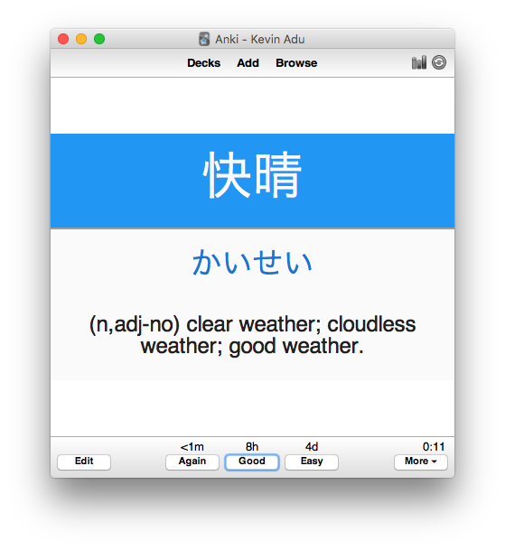
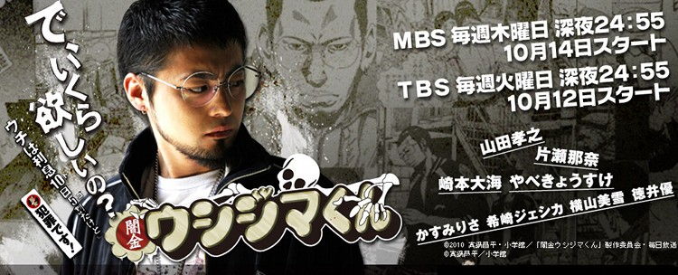
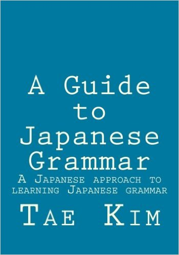
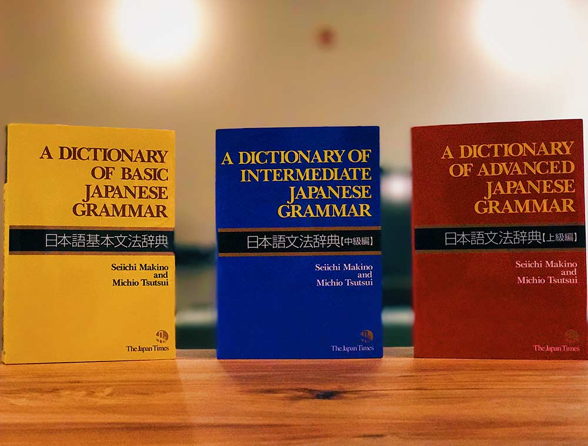
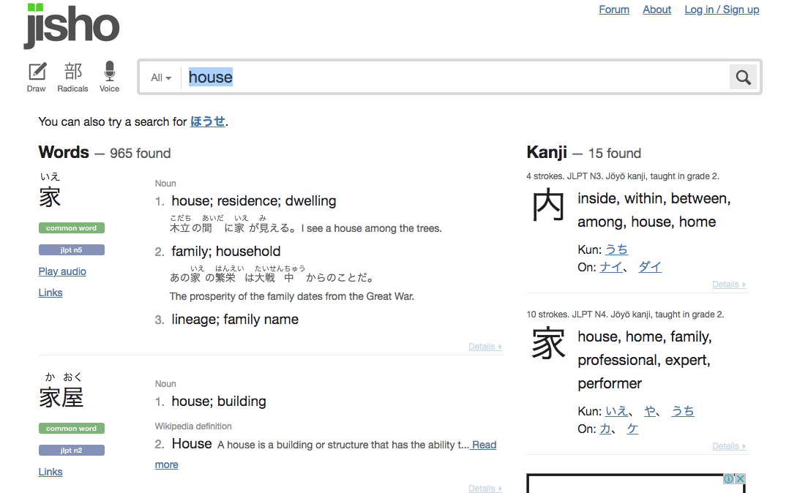

At the end of 2017, I took the [JLPT (Japanese Language Proficiency Test)](http://www.jlpt.jp/e/about/message.html) exam for the grade N2 for the third time. N2 is the second hardest level you can take for the JLPT, it can be equated to intermediate or upper intermediate level. A few days ago, I received the results for my third attempt and to my surprise not only did I pass, I managed to obtain a perfect score in listening. I had been slacking a lot in my Japanese studies for a while hence why I failed twice before so I wanted to go back the regime which helped me improve my Japanese quite quickly in the beginning. Since a few people have asked how do I study Japanese, I thought I would list the different resource and techniques I have been using so far.

### [Anki](https://apps.ankiweb.net/)

Anki is where I do the bulk of my studying. Anki is a wonderful application that allows you to memorise things quickly. It's simply a flashcard application which incorporates [SRS (Space Repetition System)](https://www.theguardian.com/education/2016/jan/23/spaced-repetition-a-hack-to-make-your-brain-store-information). The way I use it is to review anything new that I have come across in my studies. Whether it's a grammar point I learnt from a textbook or an unknown word I picked up from a Japanese drama,  it all gets added to Anki so I can memorise it sometime in the future. I usually use Anki when I'm on the train to and from work as my commute gives me ample time to go through as many flashcards as possible.

### Dramas/Anime

Watching anime or dramas helps with your listening and helps you to understand Japanese culture much better. I think when learning a language understanding the culture is key to having natural conversation to a culture you aren't yet accustomed to. Simply learning the words and trying to translate from English to Japanese in your head and say what you’ve translated will seem very unnatural. From dramas and anime, not only can you learn about culture but you will pick many interesting expressions used throughout daily life. For studying purposes, I watch with Japanese subtitles only. With English subtitles, I tend to be concentrating on just reading the English subtitles rather than focusing on what the characters are saying. With Japanese subtitles, whilst you read it, you can confirm what you have read while listening to the dialogue. Also if you couldn’t catch what someone said, you can rewind and check with the Japanese subtitles.

### Manga/Novels

Reading will help you strengthen your vocabulary and grammar knowledge. I think it’s important to read both manga and novels. In Japanese, there is a massive difference between written and spoken language. The difference between manga and novels distinctly highlight it and it is very useful to know this especially if you’re going for the JLPT qualifications.

### JLPT Textbooks

Whilst I have been studying Japanese, I have been taking the JLPT to give myself an aim so I can continue improving. I have bought textbooks to help study for the exams. Not only are these useful for passing exams, I personally feel they help fill the blanks with discovering common words you may have not come across yet in your studies. The grammar points that you need to know for the JLPT are split between written and spoken Japanese. I personally use the [Nihongo So Matome series](https://www.tofugu.com/reviews/nihongo-so-matome/) as my JLPT textbook of choice.

### [Tae Kim’s Grammar guide](http://www.guidetojapanese.org/learn/grammar)

In the beginning I was trying to decide, how should I learn grammar. I think grammar is the most important aspect of a language. In order for you to sound coherent while you are speaking or writing, you need to have a good grasp on the grammar of the language. There's a lot of debate over which Japanese grammar book you should use when you start learning Japanese. I personally use Tae Kim's Grammar Guide which is great free resource. A lot of people don't like it because of its lack of practical questions to reinforce what you have learnt and that it also starts with non-polite Japanese. I mainly like it because it gets straight to the point. I add the example sentences  into Anki and if I need further examples I find it from another source such as a novel or manga.

### [A Dictionary of Japanese Grammar Series](https://www.tofugu.com/reviews/dictionary-of-basic-japanese-grammar/)

In my day to day life, whilst reading or even talking I always seem to come across a grammar point I didn’t know. A Dictionary of Japanese Grammar contains three dictionaries one for a different level of Japanese (Beginner, Intermediate and Advanced). They contain a somewhat never-ending list of grammar points with thorough explanations and example sentences to back them up. I tend to use this when I keep coming across a grammar point I just don’t understand or pair this Tae Kim’s Grammar guide to gain a further understanding on a particular point.

### [Wanikani](https://www.wanikani.com/)

Kanji is the biggest bane for anybody with no experience reading Chinese characters. Kanji are the Chinese characters used in the Japanese language and there are 2000 commonly known kanji. I have tried many methods to learn kanji from continuously writing the character down until I remember to [Heisig’s Remembering the Kanji](https://www.amazon.com/Remembering-Kanji-Complete-Japanese-Characters/dp/0824835921) method. WaniKani is an application created by the people who own the Japanese blog [Tofugu](https://www.tofugu.com/). Kanji is presented in groups which contain similar patterns making it much easier to learn and more importantly remember. It also provides mnemonics  and present them to you in the best order for learning kanji. Unfortunately it’s not a free application but they do give a trial. I really recommend trying it out.

### [Jisho.org](http://jisho.org/)

My go-to online Japanese dictionary which I use everyday. It has a ton of features compared to your standard dictionary. You can search by a drawing of the word, radical or even voice. The dictionary informs you if it is a common word or not, which level it shows up in Wanikani and even the JLPT level. If you don’t know how to pronounce it, there’s audio and even examples sentences using the word.

### Speaking to yourself

As strange and controversial as this sounds, speaking to myself in my room helped me immensely in the beginning. When I started living in Japan, I didn’t know too many people but there is still an abundant amount of native speakers that you can engage in conversation be it in a bar or language exchange etc. For me and many other people I have spoken too, there is an anxiety to speaking in a foreign language when you begin to learn it. Speaking to yourself helps you get over this. You start to get over that anxiety by discovering your mistakes when you’re conversing; finding out which words or grammar points you don’t know that stop you from expressing yourself and just to used to the rhythm of conversation in a foreign language in general. Although this technique has it merits, it may become a habit so please execute with caution.

The list may seem a bit overwhelming but as with anything I assure you if you continue to practice everyday, not only will you improve but you will notice your improvements and that will keep the motivation going. If anyone has any other methods of learning a second language, please do let me know. I’m always curious to try a method I haven't come across.