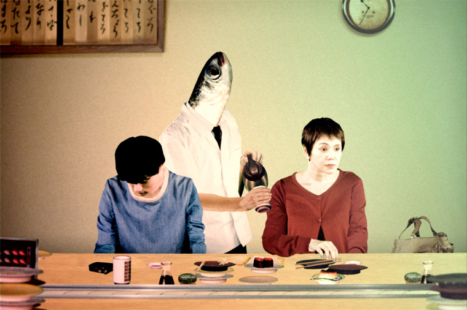

A few days ago my very good friend received some amazing news. The short film he has been working on as a producer has been nominated for Short Shorts Film Festival & Asia 2018 which is know as the official qualifier of short films to the annual Academy Awards. I have also working with him too help produce the English subtitles for this short film so my name will also appear in the credits!

 

Amazing innovation was used to create this animated short film. Over 3000 instant camera were used to this create abstract yet surreal animation which tells the story of the relationship between mother and child. It has been mentioned on various news articles such as [Yahoo News](https://headlines.yahoo.co.jp/hl?a=20180418-00000040-sph-ent.view-000).

You can check it out in Harajuku and Shibuya during these 2 days:
- Wednesday 13th June 13:30 - 15:20
- Friday 15th June 11:20 - 13:10

More details about the film and the addresses for the screening can be found here:
http://www.shortshorts.org/2018/prg/en/2229

You can also find the trailer [here](https://www.youtube.com/watch?v=A-mc8Rs-ZoI&feature=youtu.be).

Enjoy!