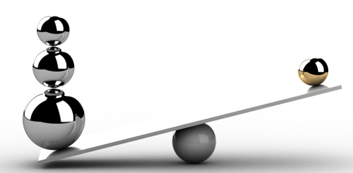

> All psychological suffering (or happiness, taken in its usual sense) is a matter of comparison.

Recently I finished reading [He: Understanding Masculine Psychology by Robert A. Johnson](https://www.goodreads.com/book/show/589278.He) and I came across a very powerful quote. This quote really resonated with me as I have felt somewhat lost for the past few months. I have definitely achieved a lot this year already but I felt that I have also made mistakes which have led me to not feel confident nor happy with myself. This is in turn has also caused a feeling of regret.

The reason this particular quote has resonated with me is because from very young I have always had the bad habit of comparing myself with others. I would ask my mother, “Why is this person taller than me?” or “Why can this person run further than me?”. At the time, I thought it was it was natural to be curious about such comparisons but I learnt it was toxic. My mother responded with some advice that I still follow to this day, “Don’t compare yourself to others. Only look at yourself and what you can do and achieve now.”

In recent months, I had forgotten my mother’s words and started seeing other people’s achievements and compared it to what I lack currently. When you look at others, you forget about yourself and what you have done and need to do and that’s what causes comparison.

Happiness as well is something that should come from within, when we start to look down at others to reassure us if we are doing well, we have once again lost ourselves. Focus on yourself and keep moving forward and in time you will see change.
